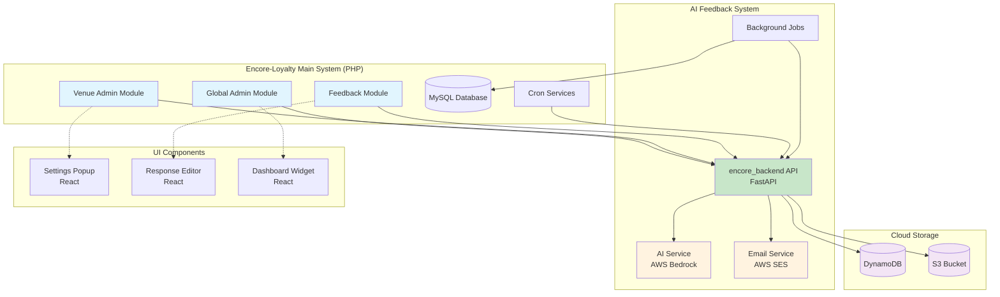
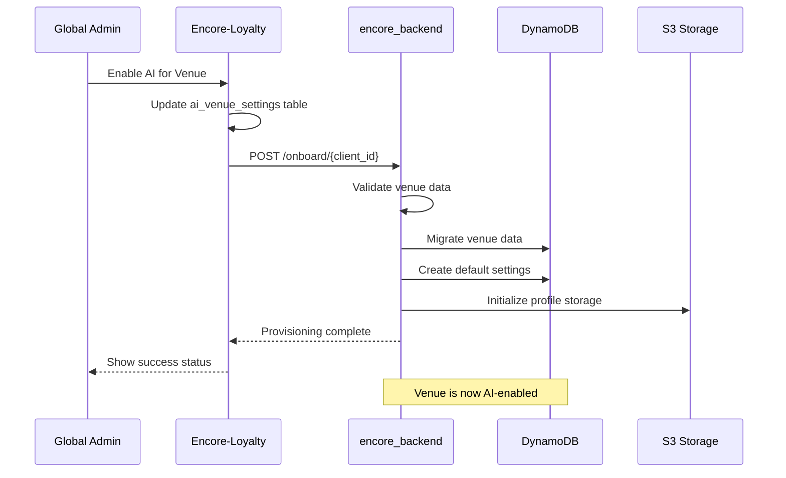
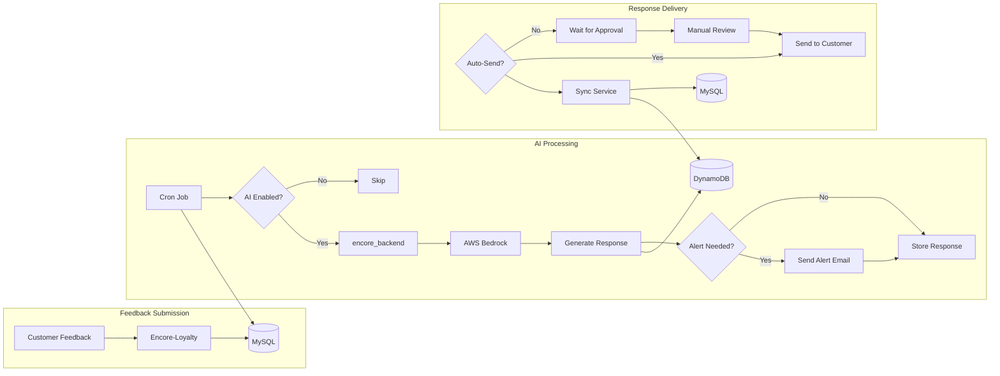
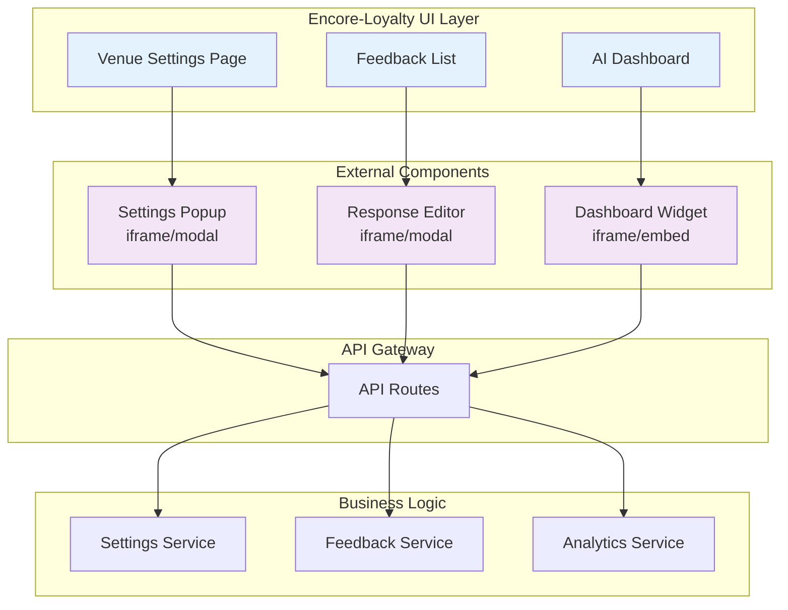
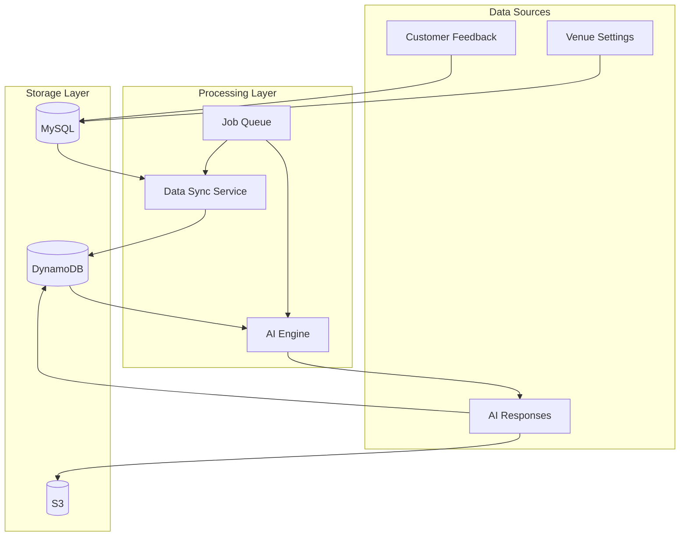
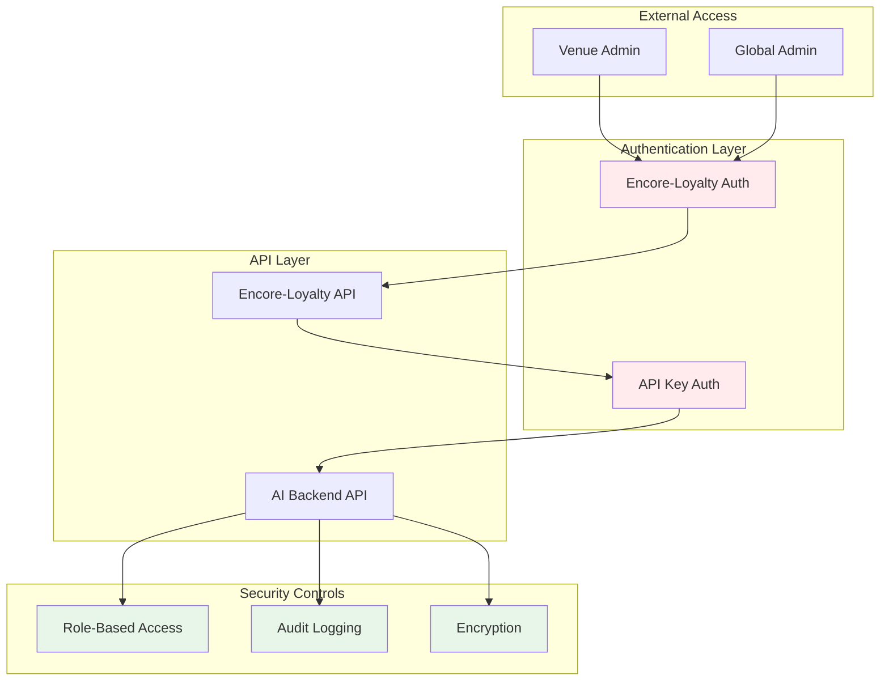
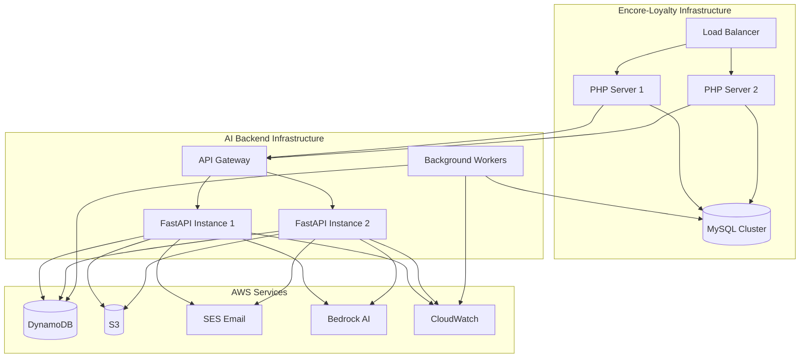
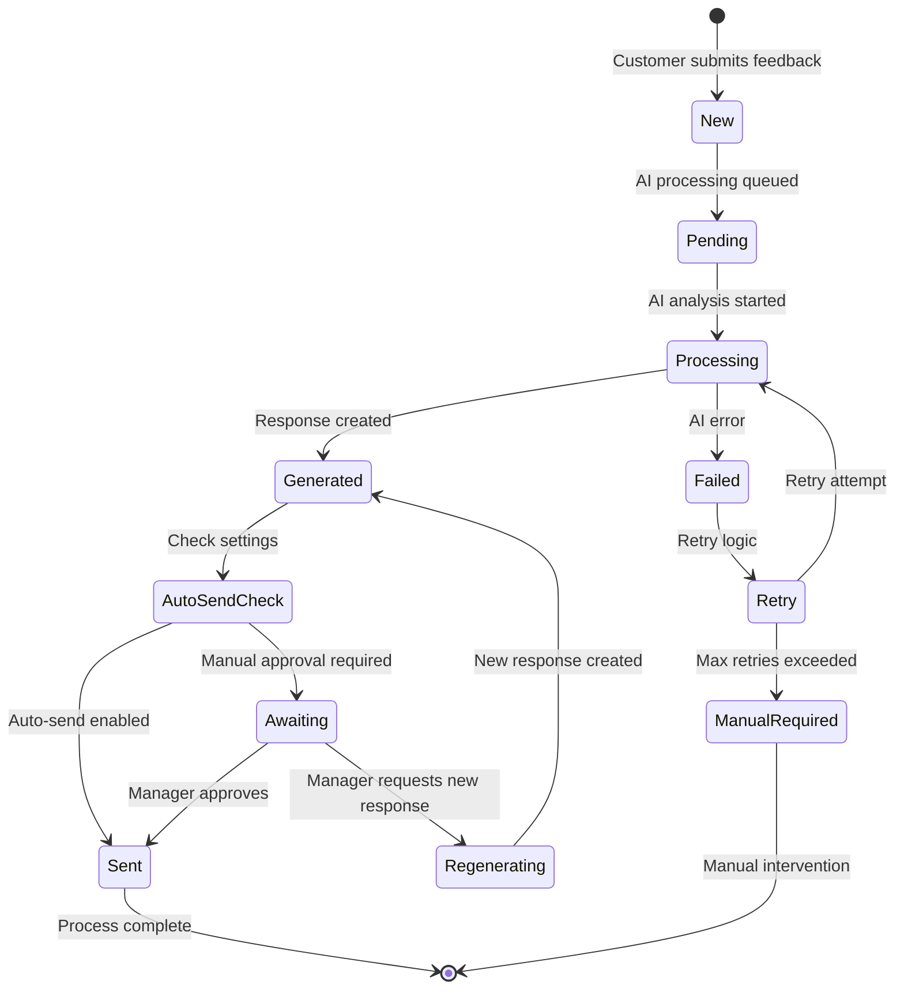
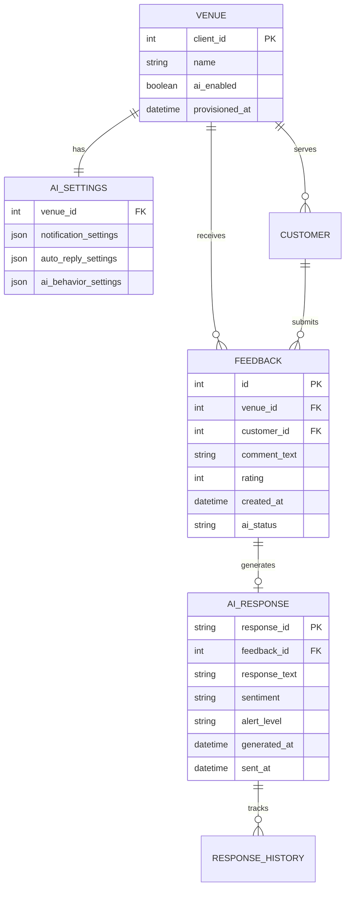
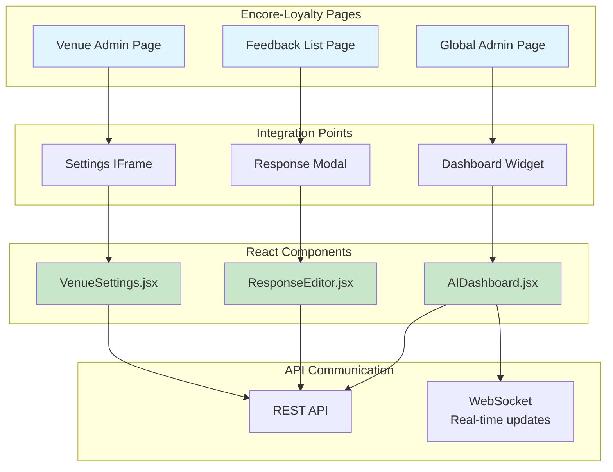

# Integration Architecture Diagrams

## 1. High-Level System Integration Architecture

## 2. Venue Provisioning Flow

## 3. Feedback Processing Flow

## 4. Component Interaction Diagram

## 5. Data Flow Diagram

## 6. Security Architecture

## 7. Deployment Architecture

## 8. State Diagram for Feedback Processing

## 9. Entity Relationship Diagram

## 10. UI Component Architecture

## Diagram Usage Guide

1. **High-Level Architecture**: Show to stakeholders for overall system
   understanding
2. **Provisioning Flow**: Use when explaining venue onboarding process
3. **Feedback Processing**: Reference for understanding the complete feedback
   lifecycle
4. **Component Interaction**: For developers implementing UI integrations
5. **Data Flow**: For database and data architects
6. **Security Architecture**: For security reviews and compliance
7. **Deployment Architecture**: For DevOps and infrastructure teams
8. **State Diagram**: For understanding feedback status transitions
9. **ERD**: For database design and relationships
10. **UI Architecture**: For frontend developers and UX designers

### Rendering Instructions

These diagrams use Mermaid syntax and can be rendered using:

- GitHub/GitLab markdown preview
- Mermaid Live Editor (https://mermaid.live)
- VS Code with Mermaid extension
- Any markdown viewer with Mermaid support
